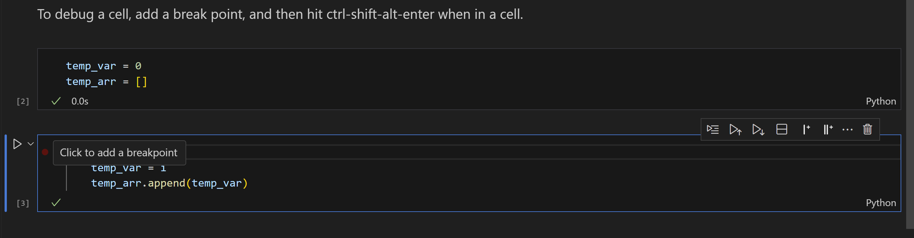
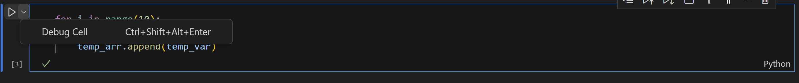
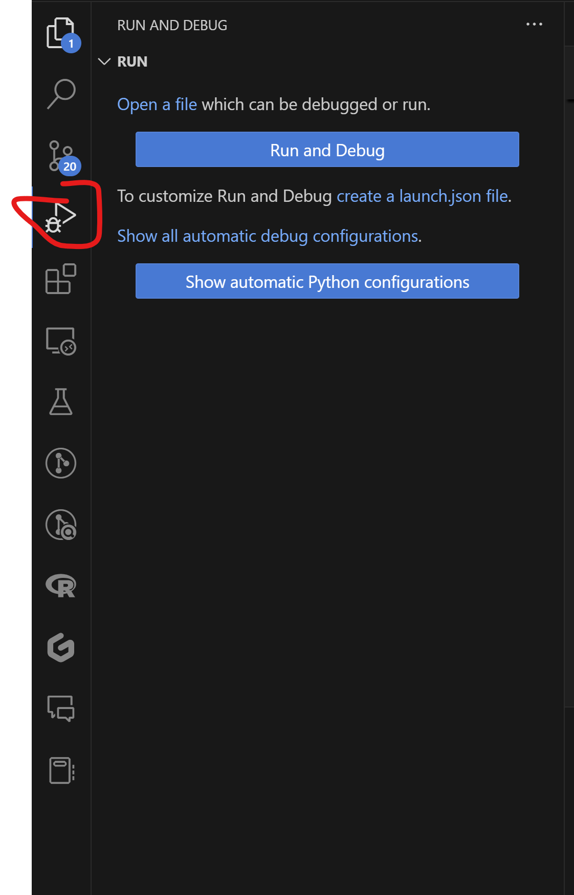
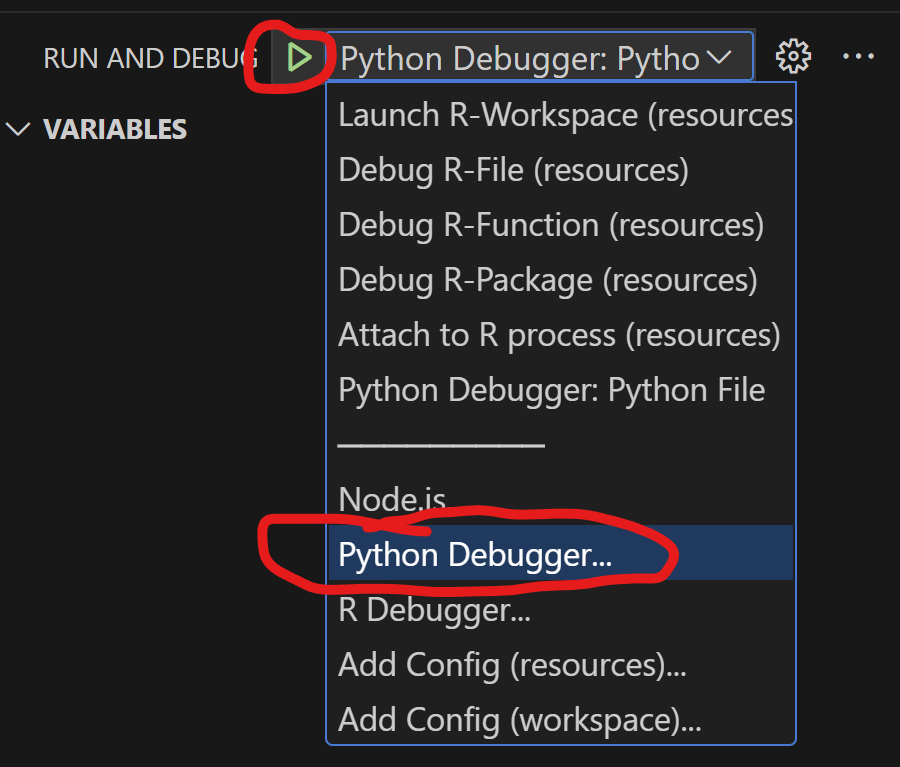
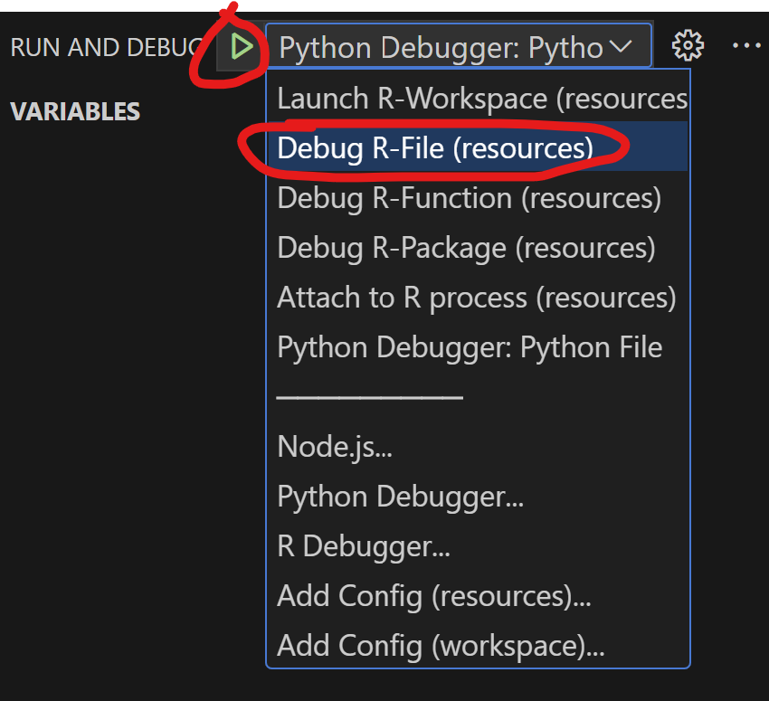
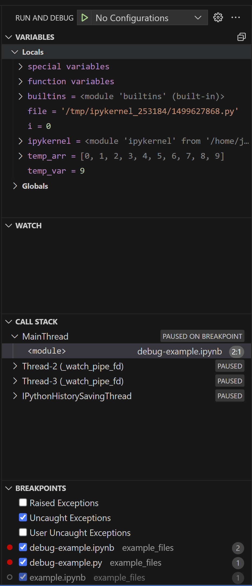

# Debugging

Debugging is an important tool when coding and vs code aid in this by allowing you to run one line at a time. 

Before continuing, make sure you have the recommended debug [extensions](extensions.md) installed

To debug in VS Code, you will add a breakpoint by clicking to the left of the line you want to stop at, and then run the debugger, depending on your file type, this is different, below are examples in a jupyter notebook, python script, and r script.

## Start Debugger

### Jupyter Notebook

[Example file](example_files/debug-example.ipynb)

1. Add your breakpoint
2. In the cell you are running, either hit ctrl-shift-alt-enter or click the dropdown next to the cell

### Python

[Example file](example_files/debug-example.py)

1. Add your breakpoint
2. Click the debug button on the left to open the debug panel

3. In the dropdown, choose "Python Debugger: Python", then click the Run button

### R
[Example file](example_files/debug-example.r)

In addition to the R debug extension, you also need to have vscDebugger installed in your R environment

1. Install vscDebugger, install.packages("vscDebugger", repos = "https://manuelhentschel.r-universe.dev")
2. Add your breakpoint
2. Click the debug button on the left to open the debug panel

3. In the dropdown, choose "Debug R-File", then click the Run button

## In Debugger

### Controls

When running the debugger, a set of controls will open near the top. The controls in order are, 
 - Continue
    - Runs code until next break point
 - Step over 
    - Runs code to next line in current scope, skipping any functions
 - Step into
    - Runs code to next line of code, if there is a function it will go into the function and run the code inside it
 - Step out
    - Finished the current function and returns to parent function
 - Restart
    - Restarts the code
 - Disconnect/Stop
    - Ends the debugger

### Panel

When the debugger is running, a panel on the left opens that shows the current variables and their values, the stack, and break points

