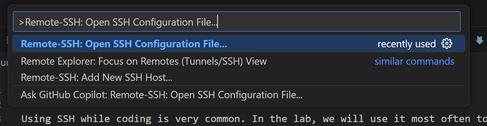
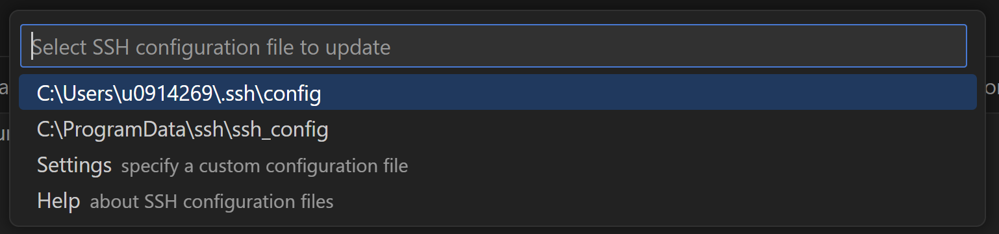
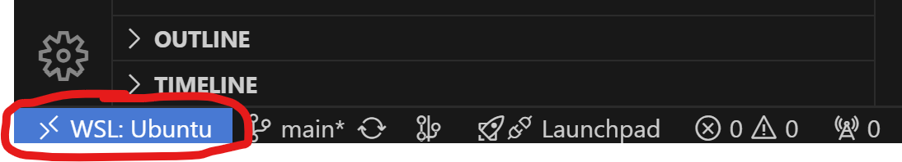
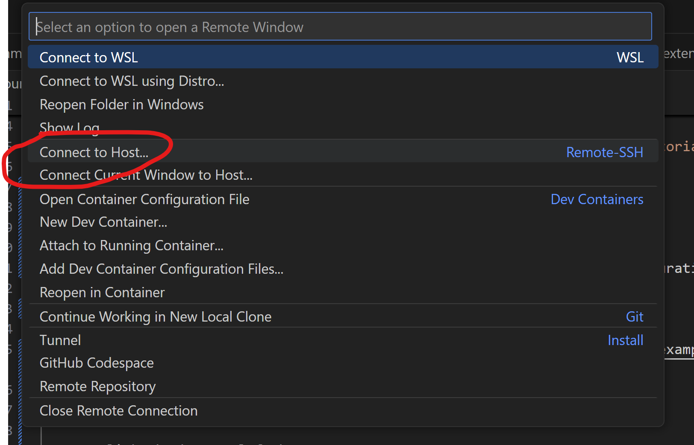
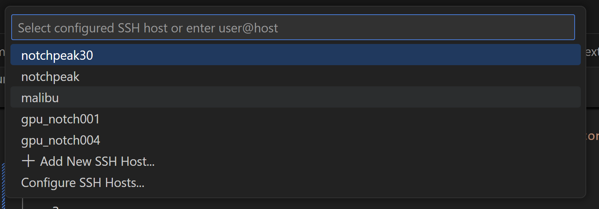
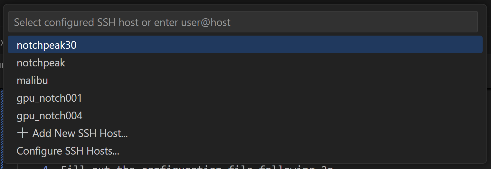

# Using Remote SSH in VS Code

Using SSH while coding is very common. In the lab, we will use it most often to connect to CHPC to run our code. To connect to it there is just a little set up. 

## Set up

### Extensions 

1. Ensure that you have the remote extensions installed (see [extensions tutorial](extensions.md))

### Configuration

2. [Do this your first time connecting to a new host] Configure your ssh config files. You can do this by either

    a. 
    
    1. Hit ctrl-shift-p (cmd-shift-p) and type "Remote-SSH: Open SSH Configuration File..."
    
    2. Hit enter, and then enter again
    
    3. Enter in your host configuration information, see [example_ssh_config](example_files/example_ssh_config) for an example

    b. 
    
    1. Click the bottom left button
    
    2. Click "connect to host"
    
    3. Click "Configure SSH Hosts..."
    
    4. Fill out the configuration file following 2a

### Connect

3. Connect to ssh host. You can do this by either

    a. 

    1. Hit ctrl-shift-p (cmd-shift-p) and type "Remote-SSH: Connect to Host..."
    
    2. Choose the host you want to connect to
    

    b. 

    1. Click the bottom left button
    
    2. Click "connect to host"
    
    3. Choose the host you want to connect to
    

----

#### [Home](readme.md)
