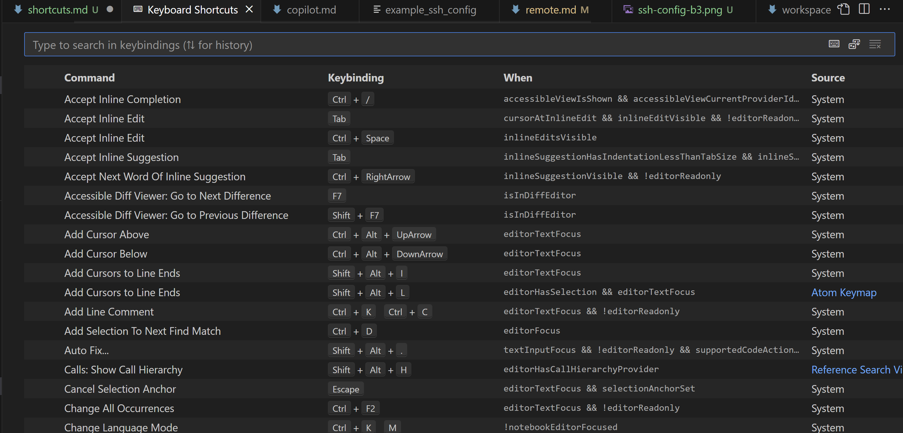
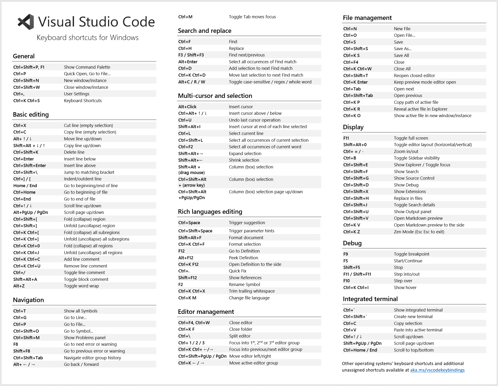

# Shortcuts

Learning keyboard shortcuts is a great way to make vs-code work for you. These keyboard shortcuts can be configured either through preferences or by installing extensions. If you are already use to the key board shortcuts of another program, like vim or atom, you can install an extension to automatically apply those to your vs code. If you are on a mac, just change any ctrl to cmd.

## Helpful shortcuts

You can view all your keyboard shortcuts by hitting ctrl-shift-p and typing "Preferences: Open Keyboard Shortcuts" 

### ctrl-shift-p

This shortcut opens the command menu and lets you type in commands to run them. These are built in commands and commands of any extensions you are using. See [remode.md](remote.md) for an example of how to use this for Remote-SSH

### ctrl-p

This shortcut opens the file explorer and lets you type any file name to open that file.

### Others

## Customize your shortcuts

You can customize your shortcuts by opening the shortcuts menu and clicking edit on any command, then typing the keys you want to bind to that action

----

#### [Home](tutorial.md)